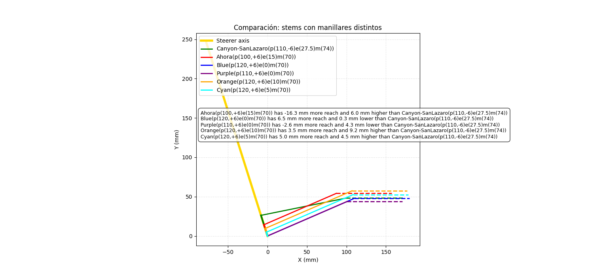

# COMPARADOR REACH+ALTURA  

Te hace el cálculo del reach real formado por la potencia y manillar  
teniendo en cuenta el ángulo de la dirección.  
Se pueden añadir varias combinaciones para comparar  
de forma visual y con datos tanto de diferencia de altura como reach.

Ejemplo de salida:

